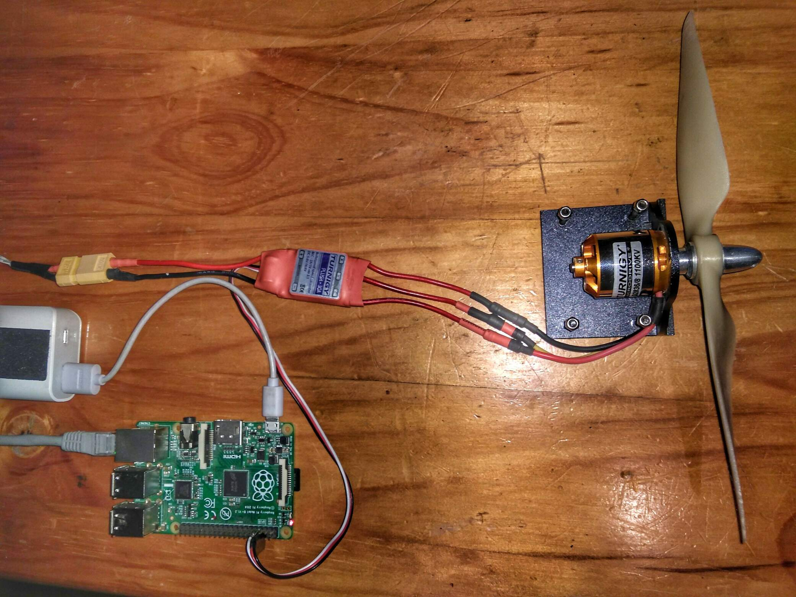

## PiPWM (Pi Pulse Width Modulation): Arm & Calibrate your ESC

This tutorial / example shows how to use a Raspberry Pi's GPIO pins to
control an Electronic Speed Controller (ESC).   Specifically, the manufacturer 
specific arming and calibration procedures (there are many other tutorials
on controlling servos, etc. with `pigpio`, Pis, and Python). 

### Project Goals:

Collect the ESC manufacture specific procedures for:

* arming
* calibration (throttle)
* modes switching (braking, response-rate, music-tunes (!), etc).


### Currently supported ESCs:

* Turnigy:
  * Plush (6A, 10A, 12A, 18A, 25A, 30A, 40A, 60A, 80A)
  * Basic (18A, 25A))





---

**Warning: Remove propellers, etc. before testing, and 
don't chop off anything important.**

---

### Everybody loves a code example:

Calibrating a Turnigy ESC for full scale throttle/controller throws:

``` python
self.pwm(width=self.MAX_WIDTH)
input("Connect power and press Enter to continue...")
self.pwm(width=self.MAX_WIDTH, snooze=2)   # Official docs: "about 2 seconds".
self.pwm(width=self.MIN_WIDTH, snooze=4)   # Time enough for the cell count, etc. beeps to play.
```

### Requirements:

* [pigpio](http://abyz.me.uk/rpi/pigpio/python.html)


### Installation:

```bash
sudo apt install python3-pigpio
# if you want it to start on boot.
sudo systemctl enable pigpiod
# in this directory.
pipenv sync
```

### Setup:

Setup description can be found here:
[](http://www.youtube.com/watch?v=aYX5TPH63Rk)


### Usage:

* Read the code, 
* Disconnect propellers, etc.
* `python3 esc_demo.py`

#### Turnigy ESC

#### Calibration
A demonstration of calibrating the ESC's maximum and minimum throttle range 
can be seen here:
[](http://www.youtube.com/watch?v=NH71n34cVI0)


#### Arming and Running

A demonstration of arming an ESC, and a subsequent full power range test 
can be seen here: 
[](https://youtu.be/J6DfSlBrbDo)


### Contributing:

Please open and issue or create a merge request if you can contribute more 
working devices or timings.  Thanks!

